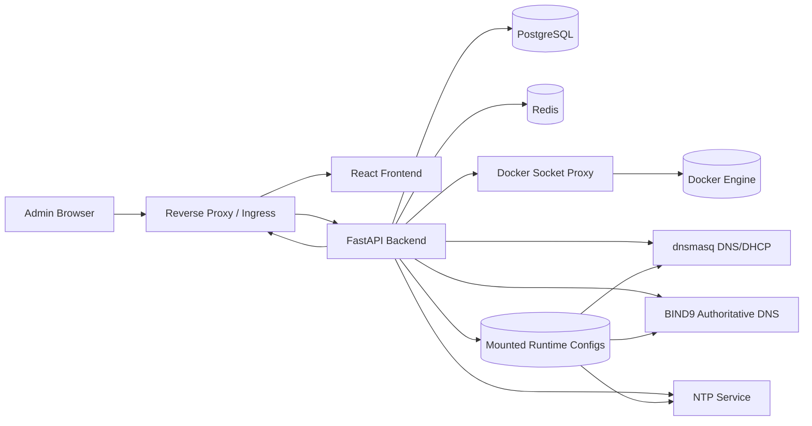

# Architecture

## Scope

This project is a single-node control plane for homelab infra services with a migration path to future multi-node/Kubernetes operation.

## Module breakdown

- `apps/frontend`
  - Operations UI (auth, dashboard, services, configs, logs, backups, health)
- `apps/backend`
  - API, auth, service orchestration, config lifecycle, audit, backup/restore
- `infra/`
  - Runtime infra service baseline configs (Caddy, dnsmasq, BIND9, NTP)
- `docs/`
  - Engineering and operational documentation

## Core management model

1. UI submits desired config (form JSON + optional raw text)
2. Backend renderer generates candidate config text
3. Validator checks service-specific constraints
4. Candidate is versioned in DB (`service_config_versions`)
5. Backend writes rendered config to mounted runtime path
6. Backend triggers `reload` (or `restart`) via Docker API
7. Result is persisted and audited
8. Rollback creates a new version from a previous version and reapplies

## Primary interfaces

- `ServiceAdapter`
- `ConfigRenderer`
- `ConfigValidator`
- `ServiceController`
- `HealthChecker`

These are implemented in `apps/backend/app/services/adapters` and make service support modular and swappable.

## Data model (v1)

- `users`
- `auth_sessions`
- `managed_services`
- `service_config_versions`
- `audit_events`
- `backup_snapshots`

Schema lifecycle is managed through Alembic migrations (`apps/backend/alembic`).

## Service dependency diagram

## Deployment topology

- `edge` network: ingress-facing (`caddy`)
- `control` network (internal): frontend/backend/data/socket-proxy
- `infra` network: managed infrastructure services + backend
- persistent storage: single shared Docker volume (`homelab_data`) with per-service subdirectories

## Future Kubernetes migration path

- Current adapter boundaries map to future operators/controllers.
- Replace Docker controller implementation with Kubernetes client implementation.
- Preserve API contracts and service adapter abstraction.
