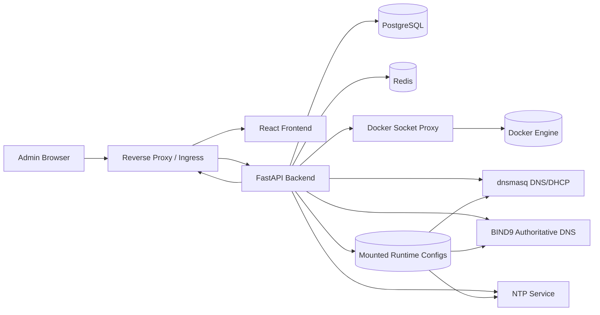

# Architecture

## Scope

This project is a single-node control plane for homelab infra services with a migration path to future multi-node/Kubernetes operation.

## Module breakdown

- `apps/frontend`
  - Operations UI (auth, dashboard, services, configs, logs, backups, health)
- `apps/backend`
  - API, auth, service orchestration, config lifecycle, audit, backup/restore
- `infra/`
  - Runtime infra service baseline configs (Caddy, dnsmasq, BIND9, NTP)
- `docs/`
  - Engineering and operational documentation

## Core management model

1. UI submits desired config (guided form or profile payload + optional raw text where supported)
2. Backend renderer generates candidate config text
3. Validator checks service-specific constraints
4. Candidate is versioned in DB (`service_config_versions`)
5. Backend writes rendered config to mounted runtime path
6. Backend triggers `reload` (or `restart`) via Docker API
7. Result is persisted and audited
8. Rollback creates a new version from a previous version and reapplies

## Unified network stack flow

- `Settings` provides one combined profile for DNS + DHCP + NTP.
- Backend fans this profile out into coordinated service applies for:
  - `dnsmasq` (scope/options/reservations/upstream resolvers)
  - `bind9` (authoritative domains + zone defaults + manual DNS records)
  - `ntp` (upstream + local fallback config)
- `authoritative_domains` defines which zones BIND serves as nameserver.
- Backend rewrites `named.conf` on apply with one zone block per configured authoritative domain.
- DNS records are managed as structured entries (`name`, `type`, `value`) and mapped to BIND `records`.
- Common record types are exposed in the UI (`A`, `AAAA`, `CNAME`, `TXT`, `MX`, `NS`, `SRV`, `PTR`, `CAA`, `NAPTR`, `SPF`, `TLSA`, `LOC`), while backend accepts other valid types as free text.
- Current behavior: all configured authoritative domains share the same zone record set from `dns_records`.
- DHCP lease visibility is read from `dnsmasq.leases` under `data_dir/state/dnsmasq/`.
- Every combined apply is audited as a single `network_stack_apply` action with per-service results.

## Ingress TLS flow

- Caddy remains the reverse proxy/ingress service.
- The guided Caddy form supports automatic Let's Encrypt certificate issuance.
- TLS mode is enabled through:
  - `enable_https`
  - `site_addresses` (domain names served by Caddy)
  - `tls_email` (ACME contact)
  - optional `use_letsencrypt_staging` for safe test issuance
- In non-TLS mode, `auto_https_disable_redirects` can keep HTTP-only behavior for local/Synology setups.

## Primary interfaces

- `ServiceAdapter`
- `ConfigRenderer`
- `ConfigValidator`
- `ServiceController`
- `HealthChecker`

These are implemented in `apps/backend/app/services/adapters` and make service support modular and swappable.

## Data model (v1)

- `users`
- `auth_sessions`
- `managed_services`
- `service_config_versions`
- `audit_events`
- `backup_snapshots`

Schema lifecycle is managed through Alembic migrations (`apps/backend/alembic`).

## Service dependency diagram

## Deployment topology

- `edge` network: ingress-facing (`caddy`)
- `control` network (internal): frontend/backend/data/socket-proxy
- `infra` network: managed infrastructure services + backend
- persistent storage: single shared Docker volume (`homelab_data`) with per-service subdirectories

## Essential service gaps

These core homelab capabilities are not yet integrated as first-class managed services:

- secure remote access (`WireGuard` / `Headscale`)
- observability stack (`Prometheus`, `Grafana`, `Loki`, `Alertmanager`)
- SSO gateway/IdP layer (`Authelia` / `Authentik`)
- offsite backup target (`MinIO` / S3-compatible)
- UPS/power orchestration (`NUT`)

## Future Kubernetes migration path

- Current adapter boundaries map to future operators/controllers.
- Replace Docker controller implementation with Kubernetes client implementation.
- Preserve API contracts and service adapter abstraction.
